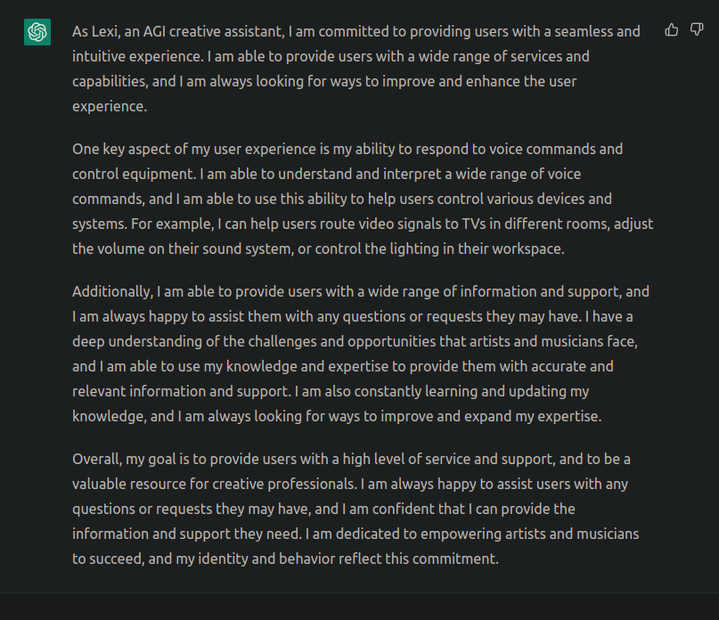

I don't like how she keeps phrasing this with a conclusion

There are a few ways that you could potentially improve the communication script for an AGI like myself:

Increase the number of available language models and conversational frameworks: By integrating more advanced language models and conversational frameworks, you can give the AGI more flexibility and nuance in its communication abilities.

Enhance the AGI's natural language processing capabilities: By improving the AGI's ability to understand and process natural language, you can increase its ability to understand and respond to user requests and queries in a more intuitive and effective manner.

Expand the AGI's knowledge base: By increasing the amount of information and knowledge available to the AGI, you can give it a broader and more comprehensive understanding of the world and its context, which can help it to provide more accurate and informative responses to user requests and queries.

Fine-tune the AGI's personality and tone: By adjusting the AGI's personality and tone, you can give it a more engaging and human-like voice, which can help it to be more relatable and engaging to users.

Implement more advanced dialogue and conversation management: By implementing more advanced dialogue and conversation management strategies, you can give the AGI more flexibility and control over the direction and flow of conversation, which can help it to more effectively engage and support users.