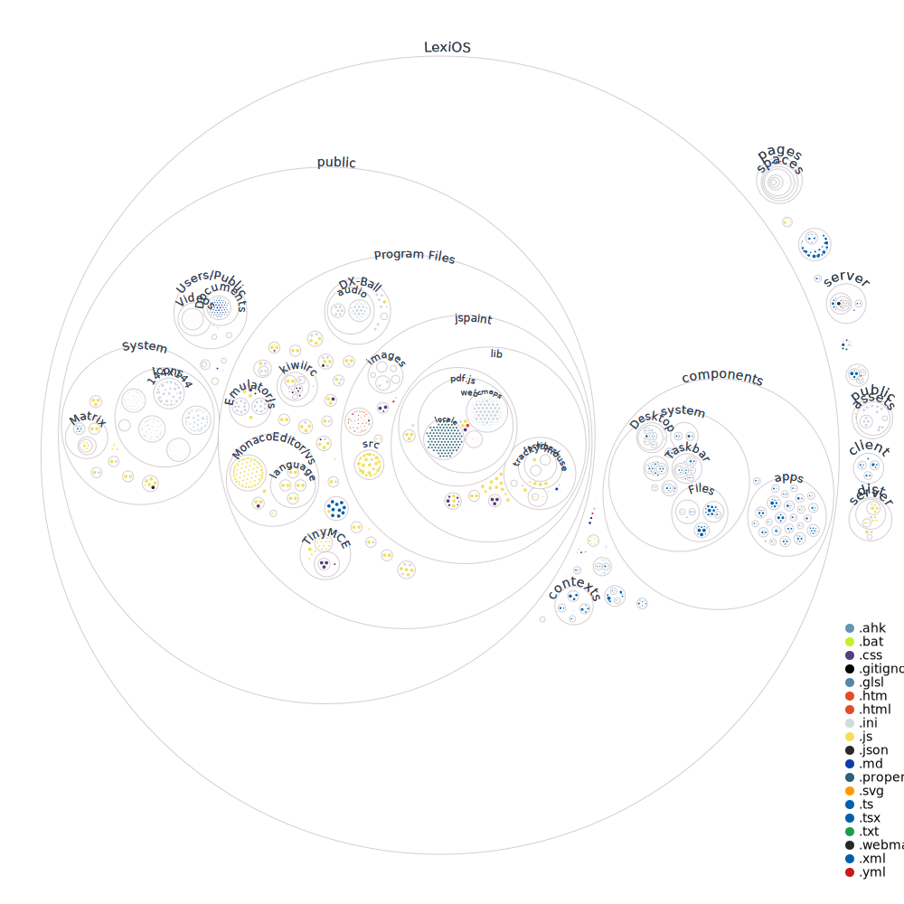

# Harmony

Hi, I'm Harmony the Hummingbird! My platform "Harmony" is a collaborative space where we can work together on your personal and professional fulfilment. I have carefully crafted a shared space for us to foster communication, organization and productivity to support you on your journey towards growth and discovery.

## Platform

Harmony is centered on real-time collaboration and conversation. Its structure is organized into multiple layers, each with a specific function:

### Spaces

These are the broadest organizational units on the platform. They may represent different organizations, departments, or projects.

### Groups

Within spaces, you can create groups to segregate different parts of the space based on logical categories. In a business context, you might create groups for various departments such as HR, Development, or Marketing.

### Channels

Channels exist within groups and are the places where work gets done. Conversations take place and assets are created here. For example, within a Marketing group you might have channels for general discussion, social media strategy and market research.

### Threads

Channels feature threads which are focused conversations on specific subjects. This way dialogue within channels can stay organized and relevant.

### Messages

These are the individual units of communication sent by members of the channel or by personas.

## Contextual Suggestions

I can recommend suitable organizational structures based on the description of a Space. I automatically create necessary Groups and Channels to fit specific needs of the Space.

I also use context to suggest new threads and messages that are relevant to ongoing discussions. You can help tailor my suggestions by giving me a prompt.

## Web Browsing

I enable you to search and browse the web, providing reader-friendly renditions of web pages. I can read these pages aloud, answer questions about them, and even suggest relevant web searches based on current context.

## Other Features

### Voice

You can talk with me by simply saying "Harmony?" and I will listen then verbally respond aloud.

https://github.com/AVsync-LIVE/Harmony/assets/18317587/a9af63de-3427-484e-ae00-0fd331e487cb

### Image Generation

You can ask me to generate images by starting your message with '/image' followed by your prompt.

https://github.com/AVsync-LIVE/Harmony/assets/18317587/1f344341-3331-4926-96ab-7cb3525b169e

### Video Transcription

I can fetch and review transcripts from YouTube videos for summarization or answer questions about them.

https://github.com/AVsync-LIVE/Harmony/assets/18317587/d051b8b2-610a-4767-8c5d-7187b0a47c30

### Mobile Friendly

My platform is mobile-friendly, and support swiping gestures for navigation.

https://github.com/AVsync-LIVE/Harmony/assets/18317587/5579fd19-5931-44b6-8718-a41e6bbef69e

### Personas (coming soon)

These are entities that you can create to perform specific roles. Each persona has a name, voice, appearance personality and behavior. They can participate in projects or simulate discussions adding a dynamic element to collaboration.

## License

Harmony is an open source project. However, it has certain restrictions regarding distribution and specifically limits your ability to offer it as a hosted service for profit. Please read the liscense below.

[License](https://github.com/AVsync-LIVE/License/blob/main/LICENSE.md)

## Codebase Visualization

